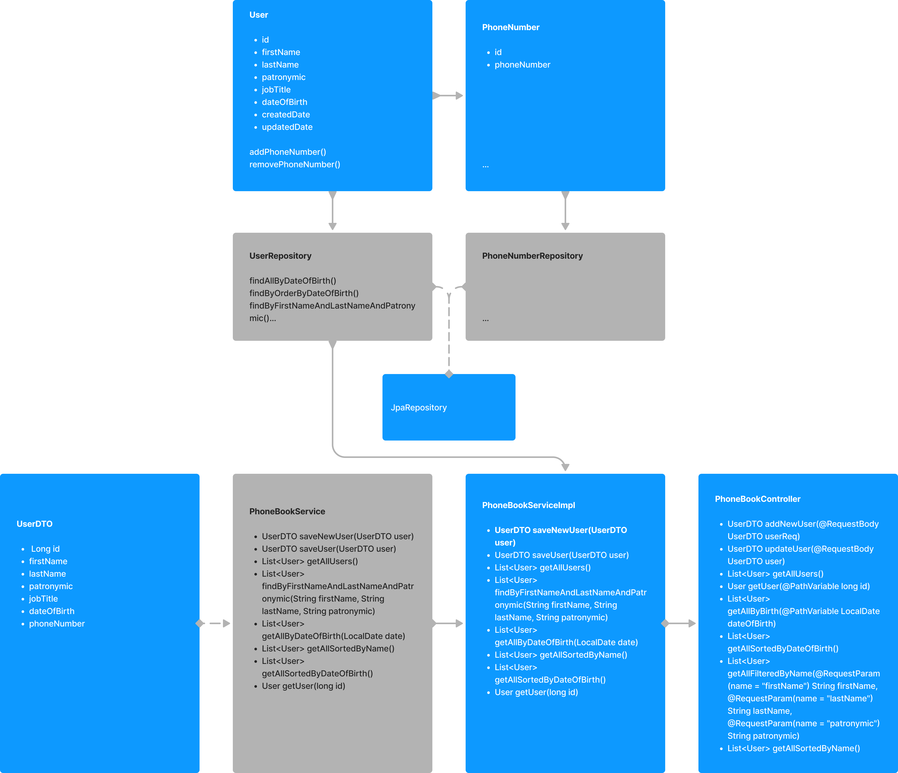

# Задание «Проектирование «Телефонного справочника»

### Постановка
Выделите основные программные объекты, атрибуты и методы необходимые для реализации API телефонного справочника. На выходе требуется создать набор классов\интерфейсов, соответствующих этим объектам (без реализации).

### Ограничения
* Данные справочника должны храниться в реляционной БД (предполагаемый объём 10^5);  
* У одного контакта может быть несколько телефонов;  
* Данный справочник планируется использовать для корпоративного портала с Web интерфейсом. На данный момент будут использованы следующие функции:
  * Создание\изменение контакта;  
  * Поиск и отображения списка контактов. Должна быть предусмотрена фильтрация и сортировка по ФИО и дате рождения;  
  * Поиск и отображение детальной информации по конкретному контакту;  
* В качестве языка программирования можно использовать: Java\Kotlin;  
* Код должен быть оформлен в соответствии с Java\Kotlin конвенцией по оформлению кода и полностью задокументирован;  
* На задачу рекомендуется потратить не более 4 часов.  

### Результаты
### Диаграмма классов

### Приложена postman коллекция со всеми доступными операциями для user и admin
PhoneBook.postman_collection.json

### Сервер
http://localhost:8084

### БД H2
http://localhost:8084/h2-console  
пользователь: sa  
пароль: -
## Реализованные запросы
#### POST http://localhost:8084/contacts/user добавление контакта
```
{  
"firstName":"Дмитриев",  
"lastName":"Дмитрий",  
"patronymic":"Дмитриевич",  
"jobTitle":"менеджер",  
"dateOfBirth":"1991-02-06",  
"phoneNumber":["+79211234567","+79217654321"]  
}   
```
ответ:
```
{  
"id": 4,  
"firstName": "Дмитриев",  
"lastName": "Дмитрий",  
"patronymic": "Дмитриевич",  
"jobTitle": "менеджер",  
"dateOfBirth": "1991-02-06",  
"phoneNumber": [  
"+79211234567",  
"+79217654321"  
]  
}  
```
#### PUT http://localhost:8084/contacts/user редактирование контакта
```
{  
"id": 4,  
"firstName": "Михайлов",  
"lastName": "Дмитрий",  
"patronymic": "Дмитриевич",  
"jobTitle": "менеджер",  
"dateOfBirth": "2000-02-06",  
"phoneNumber": [  
"+79211234567",  
"+79217654321"  
]  
}  
```
ответ  
```
{  
"id": 4,  
"firstName": "Михайлов",  
"lastName": "Дмитрий",  
"patronymic": "Дмитриевич",  
"jobTitle": "менеджер",  
"dateOfBirth": "2000-02-06",  
"phoneNumber": [  
"+79211234567",  
"+79217654321"  
]  
}  
```
#### GET http://localhost:8084/contacts/getAll запрос всех контактов
```
[  
{  
"id": 1,  
"firstName": "Иванов",  
"lastName": "Иван",  
"patronymic": "Иванович",  
"jobTitle": "менеджер",  
"dateOfBirth": "1990-01-01",  
"phoneNumbers": [  
{  
"id": 1,  
"phoneNumber": "89211111111"  
},  
{  
"id": 2,  
"phoneNumber": "89211111112"  
}  
],  
"createdDate": null,  
"updatedDate": null  
},  
...
```
#### GET http://localhost:8084/contacts/user/1 запрос контакта по ID
#### GET http://localhost:8084/contacts/getAllByBirth/1990-01-01 запрос контактов по дате рождения
#### GET http://localhost:8084/contacts/getAllSortedByDateOfBirth запрос всех контактов с сортирвкой по дате рождения
#### GET http://localhost:8084/contacts/getAllFilteredByName?firstName=Иван&lastName=Иванов&patronymic=Иванович запрос контаков по ФИО
#### GET http://localhost:8084/contacts/getAllSortedByName запрос всех контактов с сортирвкой по ФИО